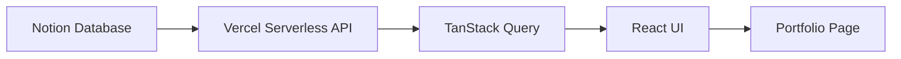
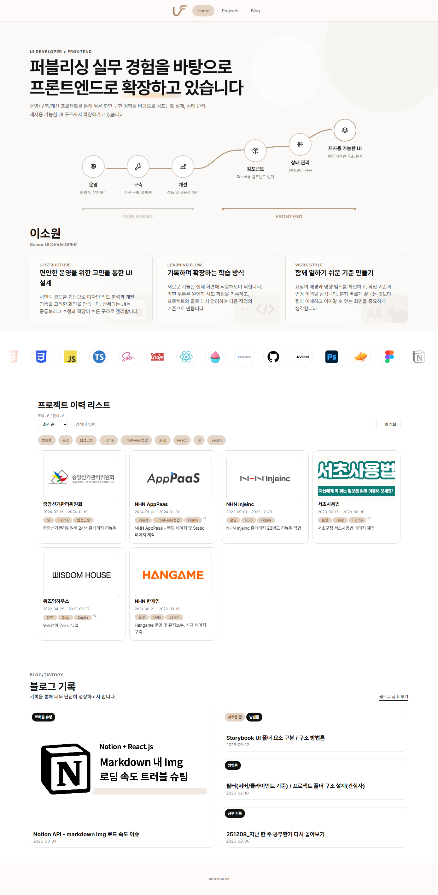
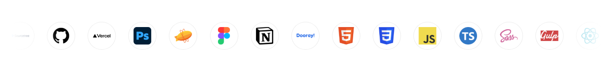
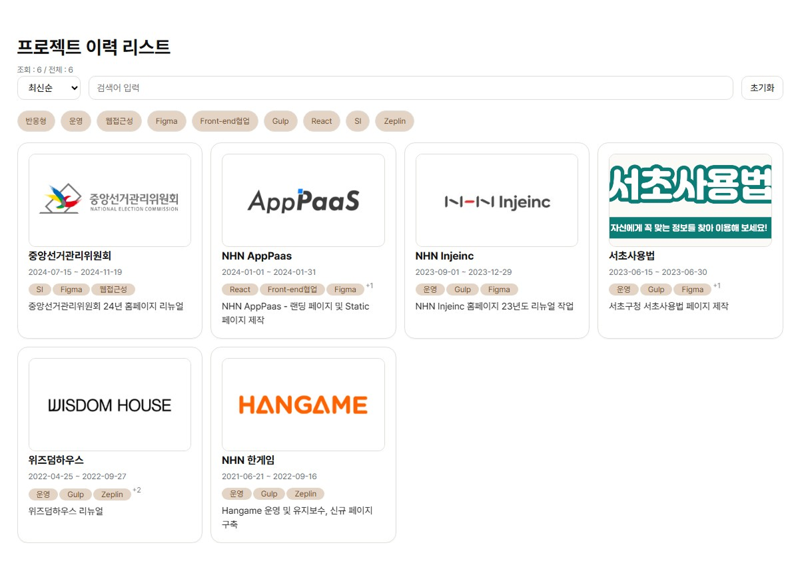
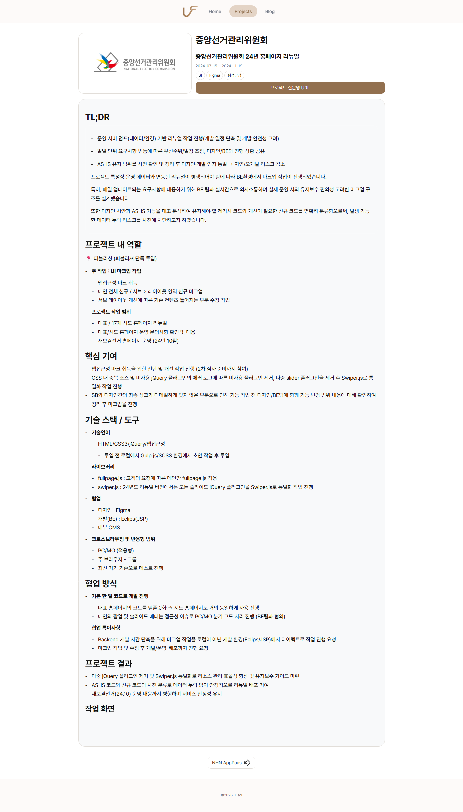
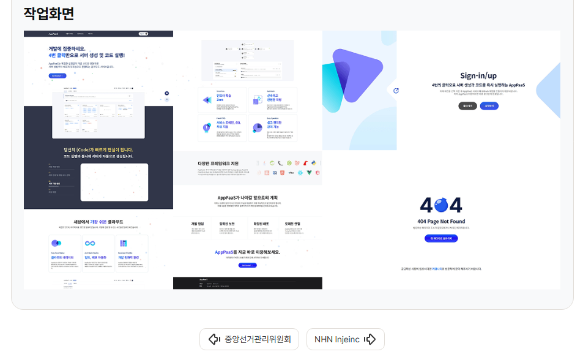
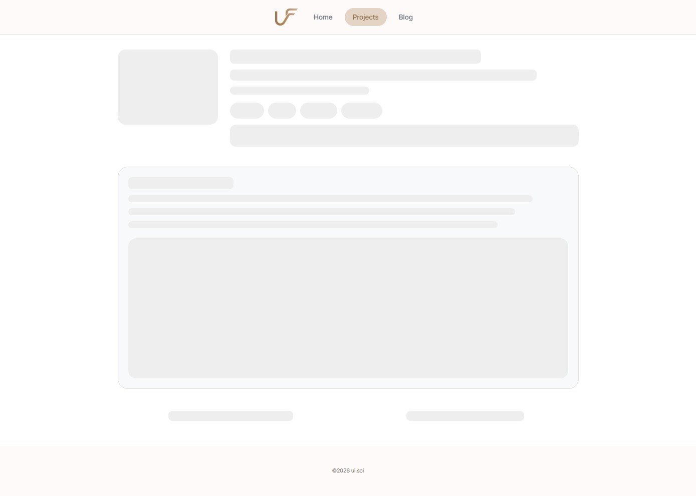
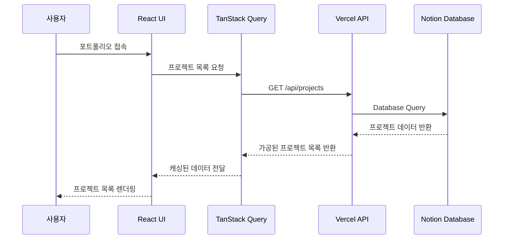

# 포트폴리오 - Notion API 활용

Notion API를 CMS처럼 활용해 프로젝트 데이터를 관리하고, React + TypeScript 기반으로 구현한 개인 포트폴리오 사이트입니다.

퍼블리셔 경험을 바탕으로 정적인 포트폴리오가 아닌, **데이터 기반으로 프로젝트 목록과 상세 콘텐츠를 관리할 수 있는 구조**를 만들어보는 것을 목표로 제작했습니다.

AI 보조 도구를 함께 이용하여 제작한 프로젝트입니다.
<br />

## 배포 링크

- Demo: https://portfolio-notion-vert.vercel.app/
- Repository: https://github.com/daily-coco/portfolio-notion

<br />

## 목차

- [프로젝트 소개](#프로젝트-소개)
- [작업 목표](#작업-목표)
- [주요 기능](#주요-기능)
- [사용 기술](#사용-기술)
- [프로젝트 구조](#프로젝트-구조)
- [API 엔드포인트](#api-엔드포인트)
- [AI 활용 방식](#ai-활용-방식)
- [실행 방법](#실행-방법)
- [환경 변수](#환경-변수)
- [개선 예정](#개선-예정)

<br />

## 프로젝트 소개

이 프로젝트는 Notion 데이터베이스를 CMS처럼 활용하여 포트폴리오 콘텐츠를 관리하는 개인 포트폴리오 사이트입니다.

기존 포트폴리오처럼 프로젝트 내용을 코드에 직접 하드코딩하는 대신,  
Notion에 프로젝트 정보를 작성하면 프론트엔드에서 해당 데이터를 불러와 화면에 렌더링하는 방식으로 구성했습니다.

<br />



<br />

## 작업 목표

- 퍼블리셔 경험을 바탕으로 React 기반 프론트엔드 구조 이해하기
- 정적 하드코딩이 아닌 데이터 기반 포트폴리오 구조 만들기
- Notion API를 활용해 콘텐츠 관리와 화면 구현 분리하기
- TanStack Query를 활용한 서버 상태 관리 경험하기
- 로딩, 에러, 빈 상태 UI를 분리하여 사용자 경험 개선하기
- Vercel Serverless Function을 활용해 API 키를 클라이언트에 노출하지 않는 구조 만들기
- 실제 배포 환경에서 환경변수, API 연동, 빌드 이슈를 점검하기

<br />

## 주요 기능

### 1. 메인 페이지

포트폴리오의 첫 화면입니다.  
간단한 자기소개, 기술 키워드, 프로젝트 목록으로 이동할 수 있는 흐름을 구성했습니다.

- 방문자가 포트폴리오의 목적을 빠르게 이해할 수 있도록 구성
- UI 개발자 포트폴리오에 맞게 시각적 인상을 주는 메인 섹션 구현
- 프로젝트 목록으로 자연스럽게 이어지는 탐색 흐름 설계

<br />



<br />

### 2. 기술 스택 소개

사용 가능한 기술 스택을 시각적으로 보여주는 영역입니다.  
단순 목록이 아니라 움직임이 있는 UI로 구성하여 포트폴리오의 첫인상을 강화했습니다.

- React 기반 컴포넌트로 기술 스택 표시
- Marquee 형태의 움직이는 UI 구현
- 퍼블리셔 경험을 살린 인터랙션 요소 적용

<br />



<br />

### 3. 프로젝트 목록 조회

Notion 데이터베이스에 등록된 프로젝트 정보를 불러와 카드 형태로 보여줍니다.

- Notion Database 기반 프로젝트 목록 조회
- 프로젝트명, 태그, 작업 기간, 썸네일 표시
- TanStack Query를 활용한 서버 상태 관리
- 로딩 / 에러 / 빈 상태에 따른 UI 분기 처리

<br />



<br />

### 4. 프로젝트 상세 페이지

프로젝트 카드를 클릭하면 slug 기반의 상세 페이지로 이동합니다.  
상세 콘텐츠는 Notion 페이지 내용을 Markdown 형태로 변환하여 렌더링합니다.

- slug 기반 프로젝트 상세 페이지 라우팅
- Notion 페이지 본문을 Markdown으로 변환
- React Markdown을 활용한 상세 콘텐츠 렌더링
- 코드 블록, 리스트, 링크 등 Markdown 콘텐츠 표시
- 새 프로젝트를 추가할 때 코드 수정 없이 Notion 콘텐츠만 관리 가능

<br />



<br />

### 5. 이전글 / 다음글 탐색

프로젝트 상세 페이지에서 이전 프로젝트와 다음 프로젝트로 이동할 수 있도록 구성했습니다.

- 현재 프로젝트의 인덱스를 기준으로 이전 / 다음 프로젝트 계산
- 상세 페이지 내에서 프로젝트 간 이동 가능
- hover 시 다음 콘텐츠를 미리 불러오는 prefetch 처리
- 사용자의 탐색 흐름을 끊지 않는 UX 고려

<br />



<br />

### 6. 상태 UI 처리

데이터를 불러오는 동안의 로딩 상태, API 요청 실패 시의 에러 상태, 데이터가 없을 때의 빈 상태를 분리했습니다.

- ContentSkeleton을 활용한 로딩 화면
- ErrorState를 통한 재시도 UI 제공
- EmptyState를 통한 빈 데이터 안내
- API 실패 상황에서도 사용자가 현재 상태를 이해할 수 있도록 구성

<br />



<br />

### 7. Notion CMS 구조

포트폴리오 콘텐츠를 Notion에서 관리하고, Vercel Serverless Function을 통해 프론트엔드에 전달합니다.

- Notion Database에서 프로젝트 목록 조회
- Slug 값을 기준으로 프로젝트 상세 콘텐츠 조회
- Notion API Token은 서버 환경변수로 관리
- 클라이언트에서는 직접 Notion API에 접근하지 않도록 구성

<br />

## 사용 기술

### Frontend

| 기술             | 설명                        |
| ---------------- | --------------------------- |
| React            | 컴포넌트 기반 UI 구현       |
| TypeScript       | 타입 기반 안정성 확보       |
| Vite             | 빠른 개발 환경 및 빌드 구성 |
| React Router DOM | 페이지 라우팅 처리          |
| React Markdown   | Markdown 콘텐츠 렌더링      |

<br />

### Data / API

| 기술                       | 설명                                      |
| -------------------------- | ----------------------------------------- |
| TanStack Query             | 서버 상태 관리, 캐싱, 로딩/에러 상태 처리 |
| Notion API                 | 프로젝트 데이터 및 상세 콘텐츠 관리       |
| notion-to-md               | Notion 페이지를 Markdown 형태로 변환      |
| Vercel Serverless Function | Notion API 요청을 서버 측에서 처리        |

<br />

### Styling / UI

| 기술            | 설명                         |
| --------------- | ---------------------------- |
| Vanilla Extract | TypeScript 기반 CSS 스타일링 |
| clsx            | 조건부 클래스 처리           |
| Framer Motion   | UI 애니메이션 구현           |
| GSAP            | 인터랙션 애니메이션 구현     |
| lucide-react    | 아이콘 사용                  |

<br />

### Test / Docs

| 기술       | 설명                           |
| ---------- | ------------------------------ |
| Storybook  | UI 컴포넌트 문서화 및 확인     |
| Vitest     | 테스트 환경 구성               |
| Playwright | 브라우저 기반 테스트 환경 구성 |
| ESLint     | 코드 품질 관리                 |

<br />

### Deploy

| 기술                  | 설명                                |
| --------------------- | ----------------------------------- |
| Vercel                | 프론트엔드 배포                     |
| Vercel Serverless API | `/api` 경로 기반 서버리스 함수 처리 |

<br />

## 프로젝트 구조

```txt
.
├─ api/
│  ├─ _types/
│  ├─ projects/
│  │  └─ slug/
│  │     └─ [slug].ts
│  └─ projects.ts
│
├─ lib/
│  └─ cache.ts
│
├─ public/
│  └─ fonts/
│
├─ src/
│  ├─ api/
│  │  └─ projects.client.ts
│  │
│  ├─ assets/
│  │  └─ images/
│  │
│  ├─ content/
│  │
│  ├─ features/
│  │  ├─ blog/
│  │  ├─ hero/
│  │  ├─ marquee/
│  │  └─ projects/
│  │
│  ├─ hooks/
│  │
│  ├─ layout/
│  │
│  ├─ pages/
│  │  ├─ Home.tsx
│  │  ├─ ProjectDetailPage.tsx
│  │  └─ ProjectDetailPage.css.ts
│  │
│  ├─ shared/
│  │  ├─ styles/
│  │  ├─ types/
│  │  └─ ui/
│  │
│  ├─ styles/
│  │
│  ├─ App.tsx
│  └─ main.tsx
│
├─ .env.example
├─ vite.config.ts
├─ package.json
└─ README.md
```

<br />

## API 엔드포인트

### 프로젝트

| Method | Endpoint                   | 설명                                                  |
| ------ | -------------------------- | ----------------------------------------------------- |
| GET    | `/api/projects`            | Notion Database에서 프로젝트 목록을 조회합니다.       |
| GET    | `/api/projects/slug/:slug` | slug 값에 해당하는 프로젝트 상세 콘텐츠를 조회합니다. |

<br />

### API 흐름



<br />

## 구현 포인트

### 1. Notion을 CMS처럼 활용

프로젝트 데이터를 코드에 직접 작성하지 않고 Notion Database에서 관리하도록 구성했습니다.  
이를 통해 새로운 프로젝트를 추가하거나 내용을 수정할 때 코드 수정 없이 콘텐츠를 관리할 수 있습니다.

<br />

### 2. API 키를 클라이언트에 노출하지 않는 구조

Notion API Token은 클라이언트 코드에서 직접 사용하지 않고,  
Vercel Serverless Function 내부에서 환경변수로 관리했습니다.

```txt
Client → /api/projects → Notion API
```

이 구조를 통해 브라우저에 민감한 API 키가 노출되지 않도록 구성했습니다.

<br />

### 3. 서버 상태 관리

TanStack Query를 사용하여 프로젝트 목록과 상세 콘텐츠의 로딩, 에러, 캐싱 상태를 관리했습니다.

- 프로젝트 목록 조회
- 프로젝트 상세 콘텐츠 조회
- 이전 / 다음 프로젝트 prefetch
- 로딩 / 에러 / 빈 상태 UI 분리

<br />

### 4. Markdown 기반 상세 콘텐츠 렌더링

Notion 페이지 본문을 Markdown으로 변환하고, React Markdown을 통해 상세 페이지에 렌더링했습니다.

이를 통해 프로젝트 상세 내용을 코드가 아닌 콘텐츠 중심으로 관리할 수 있도록 했습니다.

<br />

### 5. 사용자 탐색 흐름 개선

프로젝트 상세 페이지에서 이전글 / 다음글 이동을 제공하고,  
사용자가 이동할 가능성이 있는 콘텐츠는 미리 불러오도록 구성했습니다.

<br />

## AI 활용 방식

이 프로젝트는 AI를 보조 도구로 활용해 제작했습니다.

AI는 주로 다음과 같은 부분에서 활용했습니다.

- React + TypeScript 기반 코드 구조 설계 방향 검토
- Notion API 연동 방식 검토
- 컴포넌트 분리 기준 정리
- 로딩 / 에러 / 빈 상태 처리 방식 정리
- 배포 환경에서 발생한 오류 원인 파악
- README 및 프로젝트 문서 정리

다만 AI가 제안한 코드를 그대로 사용하는 데 그치지 않고,  
프로젝트 목적에 맞는지 확인하고 수정하며 구조와 동작 방식을 이해하는 과정을 거쳤습니다.

<br />

## 실행 방법

### 1. 저장소 클론

```bash
git clone https://github.com/daily-coco/portfolio-notion.git
cd portfolio-notion
```

<br />

### 2. 패키지 설치

```bash
npm install
```

<br />

### 3. 환경 변수 설정

루트 경로에 `.env` 파일을 생성하고 아래 값을 설정합니다.

```bash
NOTION_TOKEN=your_notion_token
NOTION_DATABASE_ID=your_notion_database_id
```

> 실제 토큰 값은 GitHub에 커밋하지 않습니다.

<br />

### 4. 개발 서버 실행

```bash
npm run dev
```

<br />

### 5. 빌드

```bash
npm run build
```

<br />

### 6. Storybook 실행

```bash
npm run storybook
```

<br />

## 환경 변수

| 이름                 | 설명                                        |
| -------------------- | ------------------------------------------- |
| `NOTION_TOKEN`       | Notion API 요청에 사용하는 토큰             |
| `NOTION_DATABASE_ID` | 프로젝트 목록을 관리하는 Notion Database ID |

<br />

## 개선 예정

- [ ] Storybook 문서 보강 (진행중)
- [ ] 접근성 테스트 항목 추가
- [ ] 프로젝트 필터링 기능 추가
- [ ] Notion 콘텐츠 업데이트 시 캐시 갱신 전략 개선
- [ ] 테스트 코드 보강
- [] 프로젝트 상세 페이지 SEO 개선

<br />

## 기여

개인 포트폴리오 프로젝트로 제작한 저장소입니다.  
외부 기여를 받기보다는 개인 작업물 정리와 학습 기록을 목적으로 관리합니다.
